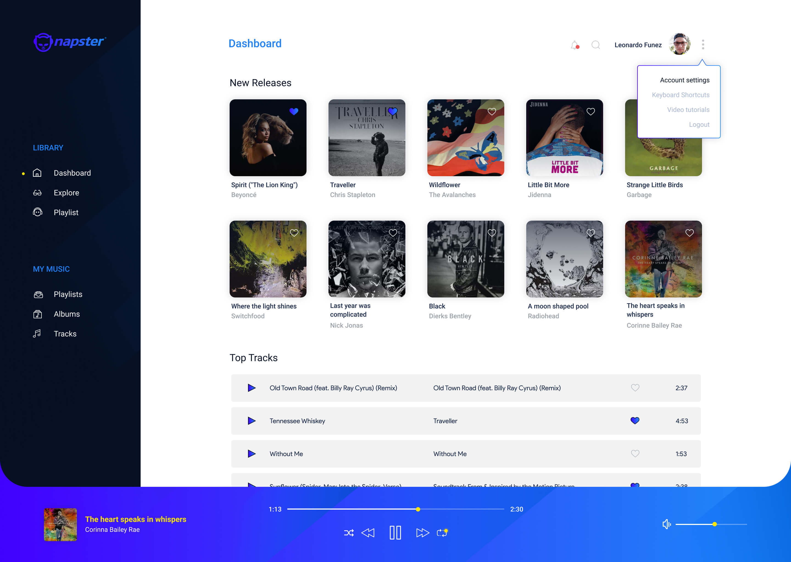
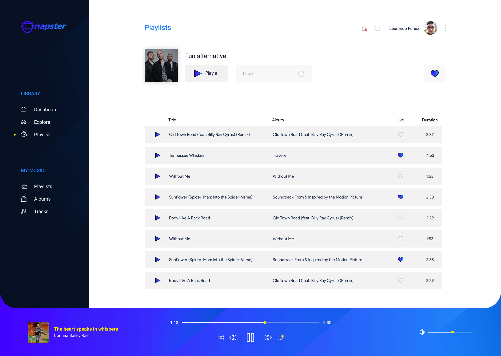

# Napster 2.0 — Vue Concept Redesign

> A modern music discovery and playback web app — a concept redesign of Napster built with Vue 2 + Napster API v2.2. Browse Top Albums, New Releases, Top Tracks, Featured Playlists, Artists and Genres, open detail pages for albums / artists / playlists / genres, like tracks, albums and playlists to build your own library (persisted in `localStorage`), and play 30s previews in a persistent bottom player with shuffle, repeat, seek and volume controls.

Live demo: `https://napster-vue.netlify.app/` (see `public/_redirects` + `og:image` in `src/App.vue`).


## Table of Contents

- [Features](#features)
- [Tech Stack](#tech-stack)
- [Dependencies](#dependencies)
- [Requirements](#requirements)
- [Getting Started](#getting-started)
- [Available Scripts](#available-scripts)
- [Project Structure](#project-structure)
- [Routing](#routing)
- [State Management (Vuex)](#state-management-vuex)
- [Napster API Integration](#napster-api-integration)
- [Components](#components)
- [Styling & Assets](#styling--assets)
- [SEO & PWA / Meta](#seo--pwa--meta)
- [Deployment](#deployment)
- [Screenshots](#screenshots)

## Features

| Area | What it does | Source |
|------|--------------|--------|
| Dashboard | Top Albums, New Releases, Top Tracks, Genres carousels/lists with cards + track rows, like buttons | `src/pages/Library/Dashboard.vue` |
| Explore | Staff picks albums, featured playlists, top artists | `src/pages/Library/Explore.vue` |
| Playlists | Featured Playlists + More Playlists (paginated via `limit`/`offset`) | `src/pages/Library/Playlists.vue` |
| Detail: Album | Album header, track list, related top albums | `src/pages/Details/Album.vue` |
| Detail: Artist | Artist header, artist albums | `src/pages/Details/Artist.vue` |
| Detail: Playlist | Playlist header, `Play all`, `Filter` search, track table with Title / Album / Like / Duration | `src/pages/Details/Playlist.vue` |
| Detail: Genre | Genre info, top playlists + top artists for genre | `src/pages/Details/Genre.vue` |
| My Music | Liked Tracks / Albums / Playlists from `localStorage` | `src/pages/MyMusic/MyTracks.vue`, `MyAlbums.vue`, `MyPlaylists.vue` |
| Likes | Heart toggle on cards + tracks, persisted as `napsterTracks`, `napsterAlbums`, `napsterPlaylists` | `src/components/LikeButton.vue`, `src/App.vue:28-32` |
| Player | Fixed bottom bar: play/pause, prev/next, shuffle, repeat, progress bar with elapsed/total, volume slider + mute, album art + title/artist | `src/components/Player.vue` |
| Navigation | Sidebar `MenuBar` (Library + My Music), top `Header` with search/bell/profile, account menu | `src/components/MenuBar.vue`, `src/components/Header.vue` |
| UX states | `Loader` component, API error message `"There are some problems with Napster API"`, 404 page | `src/components/Loader.vue`, `src/pages/Error/NotFound.vue` |
| Responsive | Mobile breakpoints for menu, header, cards, player (`position: fixed`) | `src/assets/scss/_globals.scss`, `_dark.scss` |

## Tech Stack

| Layer | Framework / Tool | Version | Purpose |
|-------|------------------|---------|---------|
| UI | Vue | `^2.6.11` | Component framework, SFCs |
| Routing | Vue Router | `^3.4.3` | History-mode SPA routing, `scrollBehavior` reset |
| State | Vuex | `^3.5.1` | Current track, tracklist, playing/paused, shuffle/repeat |
| SEO/Meta | Vue Meta | `^2.4.0` | Dynamic titles (`titleTemplate`), OG/Twitter tags, `refreshOnceOnNavigation` |
| HTTP | Axios | `^0.20.0` | `apiNapster` instance for `https://api.napster.com/v2.2` |
| Polyfills | Core-JS | `^3.6.5` | Browser compat via Vue CLI Babel preset |
| Tooling | Vue CLI Service / Babel plugin / ESLint plugin | `~4.5.0` | `serve` / `build` / `lint`, SFC compiler |
| Styles | Node-Sass + Sass-Loader | `^4.14.1` / `^9.0.3` | SCSS (`lang="scss"`), globals + dark theme |
| Lint | ESLint + babel-eslint + eslint-plugin-vue | `^6.7.2` / `^10.1.0` / `^6.2.2` | `plugin:vue/essential`, `eslint:recommended` |
| Fonts | Roboto (Google Fonts) | `300,400,500,700` | Imported in `src/App.vue` |
| Data | Napster API | `v2.2` | Albums, artists, tracks, playlists, genres |
| Hosting | Netlify (SPA redirect) | — | `public/_redirects`, live at `napster-vue.netlify.app` |

## Dependencies

### Runtime (`dependencies` in `package.json`)

| Package | Version | Badge | Used for |
|---------|---------|-------|----------|
| `vue` | `^2.6.11` |  | App, SFCs, `new Vue({router, store})` in `src/main.js` |
| `vue-router` | `^3.4.3` |  | 11 routes, history mode, `base: process.env.BASE_URL` |
| `vuex` | `^3.5.1` |  | Player + page state, getters/mutations/actions |
| `vue-meta` | `^2.4.0` |  | Per-page titles, OG/Twitter meta in `App.vue` |
| `axios` | `^0.20.0` |  | `axios.create({baseURL: .../v2.2})` in `src/services/api.js` |
| `core-js` | `^3.6.5` |  | Polyfills via `@vue/cli-plugin-babel/preset` |

### Build / Dev (`devDependencies` in `package.json`)

| Package | Version | Badge | Used for |
|---------|---------|-------|----------|
| `@vue/cli-service` | `~4.5.0` |  | `serve`, `build`, `lint` |
| `@vue/cli-plugin-babel` | `~4.5.0` |  | Preset in `babel.config.js` |
| `@vue/cli-plugin-eslint` | `~4.5.0` |  | `vue-cli-service lint` |
| `vue-template-compiler` | `^2.6.11` |  | SFC template compilation (must match `vue`) |
| `babel-eslint` | `^10.1.0` |  | Parser in `eslintConfig.parserOptions` |
| `eslint` | `^6.7.2` |  | `eslint:recommended` |
| `eslint-plugin-vue` | `^6.2.2` |  | `plugin:vue/essential` |
| `node-sass` | `^4.14.1` |  | SCSS compilation |
| `sass-loader` | `^9.0.3` |  | Webpack SCSS loader |

> Full browserslist: `> 1%`, `last 2 versions`, `not dead` (see `package.json`).

## Requirements

| Requirement | Version / Notes |
|-------------|-----------------|
| Node.js | `>=12` recommended for Vue CLI 4.5 |
| Yarn (or npm) | `yarn install` (repo includes `yarn.lock`) |
| Napster API key | Hardcoded for demo in `src/services/api.js` + `src/services/keys.js` (`ZTk2YjY4MjMtMDAzYy00MTg4LWE2MjYtZDIzNjJmMmM0YTdm`). Replace with your own for production. |
| Modern browser | Audio element + flex/grid + SCSS output |

## Getting Started

```bash
# 1. Install
yarn install

# 2. Run dev server with hot-reload (http://localhost:8080 by default)
yarn serve

# 3. Production build to dist/
yarn build

# 4. Lint and auto-fix
yarn lint
```

No `.env` required for demo — API key is in code. For your own key, edit `src/services/api.js:2` and `src/services/keys.js`.

## Available Scripts

| Script | Command | Description |
|--------|---------|-------------|
| `serve` | `vue-cli-service serve` | Compiles and hot-reloads for development |
| `build` | `vue-cli-service build` | Compiles and minifies for production to `dist/` |
| `lint` | `vue-cli-service lint` | Lints `.vue`/`.js` and fixes files |

Customize config: [Vue CLI Configuration Reference](https://cli.vuejs.org/config/).

## Project Structure

```
napster_vue/
├── public/
│   ├── index.html          # mount #app, favicons 32–180, theme-color #051023
│   ├── _redirects          # Netlify SPA fallback
│   ├── favicon.ico
│   ├── favicons/           # 32,57,76,120,152,167,180.png
│   └── social.jpg          # OG/Twitter share image
├── docs/
│   └── screenshots/        # README images only (no code)
│       ├── dashboard.jpg   # Dashboard view
│       └── playlists.jpg   # Playlist detail view
├── src/
│   ├── main.js             # Vue + VueMeta + router + store bootstrap
│   ├── App.vue             # MenuBar + Header + router-view + Player shell, metaInfo, localStorage init
│   ├── router/
│   │   └── router.js       # 11 routes, history mode, scrollBehavior
│   ├── store/
│   │   └── index.js        # Vuex: current_page/track/tracklist, playing, repeat/shuffle
│   ├── services/
│   │   ├── api.js          # Axios v2.2 wrapper: top/new/picks/featured/tracks/detail
│   │   └── keys.js         # api_key, api_secret, callback_url
│   ├── components/
│   │   ├── MenuBar.vue     # Sidebar: LIBRARY + MY MUSIC nav
│   │   ├── Header.vue      # Top bar: search, notifications, profile menu
│   │   ├── Player.vue      # Fixed audio player: Audio(), shuffle/repeat/volume
│   │   ├── Card.vue        # Album/playlist/artist cards (big/mid/content-out)
│   │   ├── Track.vue       # Track row: play, title, album, like, duration
│   │   ├── LikeButton.vue  # Heart toggle
│   │   └── Loader.vue      # Loading state
│   ├── pages/
│   │   ├── Library/        # Dashboard.vue, Explore.vue, Playlists.vue
│   │   ├── Details/        # Album.vue, Artist.vue, Genre.vue, Playlist.vue
│   │   ├── MyMusic/        # MyTracks.vue, MyAlbums.vue, MyPlaylists.vue
│   │   └── Error/          # NotFound.vue
│   └── assets/
│       ├── scss/           # _globals.scss, _colors.scss, _dark.scss, _slider.scss, _album-playlist.scss
│       ├── css/            # normalize.css
│       ├── img/            # svg icons (play, pause, next, previous, like, loader, logo, bg...)
│       └── logo.png
├── babel.config.js         # @vue/cli-plugin-babel/preset
├── package.json            # deps above + eslintConfig + browserslist
└── yarn.lock
```

## Routing

Defined in `src/router/router.js` (`mode: 'history'`, `base: process.env.BASE_URL`):

| Path | Name | Component | Description |
|------|------|-----------|-------------|
| `/` | `dashboard` | `pages/Library/Dashboard` | Top Albums, New Releases, Top Tracks |
| `/explore` | `explore` | `pages/Library/Explore` | Staff picks, featured playlists, top artists |
| `/playlists` | `playlists` | `pages/Library/Playlists` | Featured + More playlists |
| `/album/:id` | `album` | `pages/Details/Album` | Album detail + tracks |
| `/artist/:id` | `artist` | `pages/Details/Artist` | Artist detail + albums |
| `/genre/:id` | `genre` | `pages/Details/Genre` | Genre detail + top playlists/artists |
| `/playlist/:id` | `playlist` | `pages/Details/Playlist` | Playlist detail + filterable track table |
| `/my-albums` | `my-albums` | `pages/MyMusic/MyAlbums` | Liked albums |
| `/my-playlists` | `my-playlists` | `pages/MyMusic/MyPlaylists` | Liked playlists |
| `/my-tracks` | `my-tracks` | `pages/MyMusic/MyTracks` | Liked tracks |
| `*` | `not-found` | `pages/Error/NotFound` | 404 fallback |

Router key: `<router-view :key="$route.fullPath"/>` in `App.vue` forces reload on param change.

## State Management (Vuex)

Store in `src/store/index.js`:

| Piece | Type | Key |
|-------|------|-----|
| Current page title | state/getter/mutation/action | `current_page` / `GET_CURRENT_PAGE` / `set_current_page` / `SET_CURRENT_PAGE` |
| Current track | state/getter/mutation/action | `current_track {track_id, track_name, track_url, album_id, album_name, album_photo}` / `GET_CURRENT_TRACK` / `set_current_track`, `empty_current_track` / `SET_CURRENT_TRACK` |
| Current tracklist | state/getter/mutation/action | `current_tracklist` / `GET_CURRENT_TRACKLIST` / `set_current_tracklist` / `SET_CURRENT_TRACKLIST` |
| Track list queue | state/getter/mutation/action | `track_list` / `GET_TRACK_LIST` / `set_track_list` / `SET_TRACK_LIST` |
| Playing / paused | state/getter/mutation/action | `playing`, `is_paused` / `GET_PLAYING`, `GET_IS_PAUSED` / `set_playing`, `set_is_paused` / `SET_PLAYING`, `SET_IS_PAUSED` |
| Repeat / shuffle | state/getter/mutation/action | `repeat`, `shuffle` / `GET_REPEAT`, `GET_SHUFFLE` / `set_repeat`, `set_shuffle` / `SET_REPEAT`, `SET_SHUFFLE` |

Player logic (`Player.vue`): native `new Audio()`, `playTrack`/`pauseTrack`/`prevTrack`/`nextTrack`, `shuffleTrackList`, `repeatTrack`, progress `%`, time formatting, volume `1–10` + mute.

Likes persistence (`App.vue:created`): initializes `napsterTracks`, `napsterAlbums`, `napsterPlaylists` in `localStorage` if null.

## Napster API Integration

Base: `https://api.napster.com/v2.2` via `axios.create` (`src/services/api.js`), `apikey` query param.

| Method | Endpoint | Used in |
|--------|----------|---------|
| `getTopAlbums(limit)` | `GET /albums/top?limit=` | Dashboard Top Albums |
| `getNewReleases(limit)` | `GET /albums/new?limit=` | Dashboard New Releases |
| `getGenres(limit)` | `GET /genres?limit=` | Dashboard |
| `getTopTracks(limit)` | `GET /tracks/top?limit=` | Dashboard Top Tracks |
| `getStaffAlbums(limit)` | `GET /albums/picks?limit=` | Explore |
| `getTopPlaylists(limit)` / `getFeaturedPlaylists(limit)` | `GET /playlists/featured?limit=` | Explore / Playlists |
| `getTopArtists(limit)` | `GET /artists/top?limit=` | Explore |
| `getMorePlaylists(limit, offset)` | `GET /playlists?limit=&offset=` | Playlists pagination |
| `getAlbumDetail(id)` / `getAlbum(id)` | `GET /albums/:id` | Album detail |
| `getAlbumTracks(id)` | `GET /albums/:id/tracks` | Album tracks |
| `getArtistDetail(id)` | `GET /artists/:id` | Artist detail |
| `getArtistAlbums(id)` | `GET /artists/:id/albums` | Artist albums |
| `getPlaylistDetail(id)` / `getPlaylist(id)` | `GET /playlists/:id` | Playlist detail |
| `getPlaylistTrack(id)` | `GET /playlists/:id/tracks?limit=100` | Playlist tracks |
| `getGenreDetail(id)` | `GET /genres/:id` | Genre detail |
| `getGenreTopPlaylists(id)` | `GET /genres/:id/playlists/top` | Genre playlists |
| `getGenreTopArtists(id)` | `GET /genres/:id/artists/top` | Genre artists |
| `getTrack(id)` | `GET /tracks/:id` | Single track |
| `getFeaturedAlbums()` | `GET /albums/top?limit=5` | Related albums |

Keys in `src/services/keys.js`: `api_key`, `api_secret`, `callback_url: http://localhost:8080/login`.

## Components

| Component | Responsibility | Props / Notes |
|-----------|----------------|---------------|
| `MenuBar.vue` | Left sidebar, LIBRARY (Dashboard, Explore, Playlist) + MY MUSIC (Playlists, Albums, Tracks) | Active dot, SVG icons from `assets/img/` |
| `Header.vue` | Page title, bell with dot, search, user `Leonardo Funez` + avatar, `Account settings / Keyboard Shortcuts / Video tutorials / Logout` menu |  |
| `Player.vue` | Bottom gradient bar (blue/purple), art + yellow title, progress `1:13 / 2:30`, controls, volume | 524 lines, Audio API |
| `Card.vue` | Cover grid cards with heart overlay | `id, title, subtitle, image, type, card_style=big/mid/content-out` |
| `Track.vue` | Row: `▶ Title … Album … ♡ Duration` (e.g. `Old Town Road … 2:37`) | `track_id, track_title, track_url, album_*, artist_*, is_liked, tracklist_type` |
| `LikeButton.vue` | Heart toggle (outline ↔ blue gradient) | Emits like/unlike, syncs `localStorage` |
| `Loader.vue` | `text, visible` loading placeholder | e.g. `Loading albums...` |

## Styling & Assets

| Item | Details |
|------|---------|
| Language | SCSS in SFCs (`lang="scss"`) + global `src/assets/scss/_globals.scss`, `_colors.scss`, `_dark.scss`, `_slider.scss`, `_album-playlist.scss`, `normalize.css` |
| Font | `Roboto 300,400,500,700` via Google Fonts in `App.vue` |
| Theme | Light content + dark sidebar `#051023`, blue primary, purple-blue player gradient, yellow active track title |
| Icons | SVG in `src/assets/img/` (play, pause, next, previous, shuffle, repeat, like, loader, logo, bg), favicons 32–180 in `public/favicons/` |
| Images | Covers from Napster CDN (`album_photo`), local `logo.png`, `profile` png in `dist/` |

## SEO / PWA / Meta

From `src/App.vue:metaInfo` + `public/index.html`:

| Tag | Value |
|-----|-------|
| `title` | `Napster Concept Redesign` + per-page `titleTemplate: %s \| Playlists` etc. |
| `description` | `This is a concept redesing using VueJS and Napster API. By Leonardo Funez` |
| `og:title/description/image` | Same + `https://napster-vue.netlify.app/social.jpg` |
| `twitter:card/title/description/image/creator` | `summary` / same / `@lfunezdelchiaro` |
| `theme-color` | `#051023` |
| `favicon` | `favicon.ico` + Apple touch icons 57–180 |

## Deployment

| Step | Notes |
|------|-------|
| Build | `yarn build` → `dist/` (already committed in history, but gitignored via standard Vue CLI? Check before deploy) |
| SPA fallback | `public/_redirects` → `/* /index.html 200` for Netlify history mode |
| Live URL | `https://napster-vue.netlify.app/` |
| Share image | `public/social.jpg` (335 KB) used for OG/Twitter |

## Screenshots

### 1. Dashboard — New Releases & Top Tracks

Sidebar Library (Dashboard / Explore / Playlist) + My Music (Playlists / Albums / Tracks). Main shows `New Releases` card grid (e.g. Beyoncé – Spirit, Chris Stapleton – Traveller, The Avalanches – Wildflower) with like hearts, `Top Tracks` table (`Old Town Road (Remix) – 2:37`, `Tennessee Whiskey – 4:53`, `Without Me – 1:53`), header with notifications, search, profile menu (`Account settings`), and fixed bottom player playing `The heart speaks in whispers – Corinne Bailey Rae (1:13 / 2:30)` with shuffle / prev / pause / next / repeat + volume.



### 2. Playlists — Playlist Detail

Playlist view for `Fun alternative` with cover, `Play all` button, `Filter` search input, liked heart, track table columns `Title | Album | Like | Duration` (e.g. `Tennessee Whiskey – Traveller – 4:53`, `Sunflower (Spider-Man: Into the Spider-Verse) – Soundtrack… – 2:38`, `Body Like A Back Road – 2:29`), same sidebar + bottom player.


